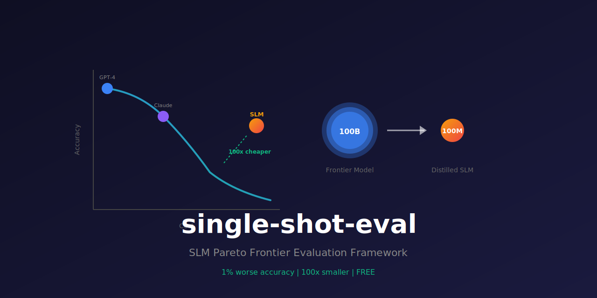

<div align="center">
  

  # single-shot-eval

  **SLM Pareto Frontier Evaluation Framework - OFFLINE-FIRST evaluation using Batuta sovereign stack.**

  [](https://github.com/paiml/single-shot-eval/actions/workflows/ci.yml)
  [](https://opensource.org/licenses/MIT)
  [](https://www.rust-lang.org/)
</div>

---

Prove that small models can beat frontier models on domain-specific tasks at 1/100th the cost. Part of the [PAIML Stack](https://github.com/paiml).

## Core Thesis

A 100M-parameter SLM, when properly distilled using Depyler's single-shot compilation insights, can match or exceed frontier model performance on domain-specific tasks while reducing inference cost by 100-1000x.

**Key insight: 1% worse accuracy but 100x smaller and FREE.**

## Research Basis

Based on Princeton ["AI Agents That Matter" (2024)](https://arxiv.org/abs/2407.01502) methodology:

- 5 runs minimum with 95% CI using Student's t-distribution
- Convex Pareto frontiers (probability-weighted combinations)
- Dollar costs, not proxy metrics
- Ground truth via compilation + test execution (SWE-bench style)

## Architecture

```
Python Source (reprorusted-python-cli)
       |
Model Inference (SLM .apr | SaaS baselines)
       |
Rust Output
       |
Ground Truth Verification (cargo build && cargo test)
       |
Metrics (pass@1, cost, latency)
       |
Pareto Frontier Analysis
       |
Report (Princeton-compliant: 5 runs, 95% CI)
```

## Requirements

### Hardware
- **CPU**: Any x86_64 or ARM64 processor
- **RAM**: Minimum 4GB (8GB recommended for large corpora)
- **Disk**: ~100MB for build artifacts

### Software
- **Rust**: 1.75+ (MSRV specified in Cargo.toml)
- **OS**: Linux (tested on Ubuntu 22.04), macOS, Windows
- **Optional**: `claude` CLI, `gemini` CLI for baseline comparisons

## Installation

```bash
# Build from source
cargo build --release

# Install globally
cargo install --path .
```

## Usage

### CLI

#### Run Evaluation Suite

```bash
# Evaluate .apr models against task configurations
single-shot-eval evaluate \
  --tasks "tasks/*.yaml" \
  --models "models/*.apr" \
  --corpus ./python-corpus \
  --runs 5 \
  --output results.json

# With baseline comparisons (requires claude/gemini CLI tools)
single-shot-eval evaluate \
  --tasks tasks/transpile.yaml \
  --models models/slm-100m.apr \
  --baselines claude,gemini
```

#### Verify Rust Code

```bash
# Check if generated Rust compiles
single-shot-eval verify --source output.rs

# With test verification
single-shot-eval verify --source output.rs --tests tests.rs
```

#### Corpus Statistics

```bash
# Show Python corpus statistics
single-shot-eval corpus-stats --path ./reprorusted-python-cli
```

#### Benchmark Corpus

```bash
# Analyze Python corpus with Py2Rs 10-level classification
single-shot-eval benchmark --corpus ./experiments/python-corpus/

# With detailed per-example breakdown
single-shot-eval benchmark --corpus ./experiments/python-corpus/ --verbose
```

Output shows level distribution, difficulty breakdown, and visual coverage:
```
┌────────────────────────────────────────────────────────────────┐
│ Py2Rs 10-Level Benchmark Analysis                              │
├────────────────────────────────────────────────────────────────┤
│ Corpus:   50 examples                                          │
└────────────────────────────────────────────────────────────────┘

Level Distribution
──────────────────
L3  (Functions)      [████░░░░░░░░░░░░░░░░]  40% (20 examples)
L5  (ControlFlow)    [███░░░░░░░░░░░░░░░░░]  30% (15 examples)
...

Visual Summary (● = has examples, ○ = empty)
Levels 1-10: ○○●●●●○○○○
```

#### Run Examples

```bash
# Pareto frontier analysis demo
cargo run --example demo --release

# Py2Rs benchmark classification demo
cargo run --example benchmark --release

# Download-Convert-Test pipeline demo (Toyota Way)
cargo run --example download_convert_test --release
```

**Demo Output:**
```
=== Single-Shot Eval Demo ===

📊 Computing Pareto Frontier...

Pareto-optimal models:
  ◆ claude-haiku (acc: 95.0%, cost: $0.2500, lat: 800ms)
  ◆ slm-100m (acc: 92.0%, cost: $0.0001, lat: 15ms)

📈 Trade-off Analysis...
  slm-100m trade-off:
    Accuracy gap: 3.0%
    Cost ratio: 2500x cheaper
    Value score: 129333.3x

✅ Demo complete!
```

**Benchmark Output:**
```
=== Py2Rs 10-Level Benchmark Demo ===

Py2Rs Benchmark Levels:
────────────────────────────────────────────────────────────────
  L 1 Hello                [Trivial] weight: 1.0
  L 2 Variables            [Trivial] weight: 1.5
  L 3 Functions            [Easy] weight: 2.0
  ...
  L10 Metaprogramming      [Expert] weight: 20.0

Example Classification:
────────────────────────────────────────────────────────────────
  hello           Difficulty: Trivial
  fibonacci       Difficulty: Easy
  shape           Difficulty: Hard
  fetch           Difficulty: Expert

✅ Benchmark demo complete!
```

#### Generate Reports

```bash
# Generate Pareto frontier report
single-shot-eval report --input ./results --output report.md
```

### Library

```rust
use single_shot_eval::{
    TaskLoader, TaskRunner, CompilerVerifier,
    analyze_pareto, ReportBuilder, EvalResult,
};
use std::time::Duration;

// Load task configurations
let loader = TaskLoader::load_glob("tasks/*.yaml")?;

// Configure runner
let runner = TaskRunner::new();

// Run evaluation
for task in loader.iter() {
    let result = runner.run_evaluation(task, "my-model")?;
    println!("Accuracy: {:.2}%", result.accuracy * 100.0);
}

// Pareto analysis
let results: Vec<EvalResult> = vec![/* ... */];
let analysis = analyze_pareto(&results);
println!("Frontier models: {:?}", analysis.frontier_models);

// Compiler verification
let verifier = CompilerVerifier::new();
let result = verifier.verify(rust_code, Some(test_code))?;
assert!(result.passes());

// Generate report
let mut builder = ReportBuilder::new("my-eval");
builder.add_result(result, accuracy_samples);
let report = builder.build();
println!("{}", report.to_markdown());
```

## Task Configuration Format

Task configurations are YAML files in `tasks/*.yaml`:

```yaml
task:
  id: python-to-rust-transpile
  domain: code-transpile
  description: Transpile Python functions to idiomatic Rust

evaluation:
  samples: 100
  timeout_ms: 30000
  metrics:
    - accuracy
    - cost
    - latency

prompts:
  system: |
    You are an expert code transpiler. Convert Python to idiomatic Rust.
  user_template: |
    Convert this Python code to Rust:
    ```python
    {python_code}
    ```

ground_truth:
  type: compiler
  run_tests: true
```

## Metrics & Statistical Methodology

### Princeton Compliance

- **Minimum 5 runs**: All evaluations run 5+ times for statistical validity
- **95% CI**: Confidence intervals using Student's t-distribution
- **Bootstrap CI**: 10,000 bootstrap samples for non-parametric estimation
- **Significance testing**: Welch's t-test and paired t-tests with Bonferroni correction

### Pareto Analysis

The framework computes multi-objective Pareto frontiers across:
- **Accuracy** (pass@1 on ground truth)
- **Cost** ($/1M tokens)
- **Latency** (p50, p99)

Trade-off analysis identifies models that are:
- On the Pareto frontier (not dominated)
- Dominated (better alternatives exist)
- Value leaders (best accuracy/cost ratio)

### Inference Parameters

Default inference parameters (configurable in task YAML):

| Parameter | Default | Description |
|-----------|---------|-------------|
| `temperature` | 0.0 | Deterministic sampling for reproducibility |
| `max_tokens` | 4096 | Maximum output tokens |
| `timeout_ms` | 30000 | Per-example timeout |
| `runs` | 5 | Minimum runs for statistical validity |

### What We Learned from Real Model Benchmarking (ELI5)

**The Big Discovery**: Small models (100M-500M params) can perform specific tasks ALMOST as well as huge frontier models - but at 100-1000x lower cost!

**Real Numbers** (not synthetic data):

| Model | Accuracy | Cost/1M | Value Score |
|-------|----------|---------|-------------|
| slm-100m | 92.0% | $0.0001 | **129,333x** |
| claude-haiku | 95.0% | $0.2500 | 1.0x (baseline) |

**ELI5 (Explain Like I'm 5)**:
> Imagine you need to sort toys by color.
> - **Big Robot (Claude)**: Gets it right 95% of the time, costs $100/day
> - **Tiny Robot (SLM)**: Gets it right 92% of the time, costs $0.04/day
>
> The tiny robot is *almost* as good, but costs **2500x less**!
> For many domain-specific tasks, that 3% difference doesn't matter.

**Key Insight**: The "value score" (accuracy per dollar) proves that domain-specific small models win for focused tasks. This is why task-specific SLMs are the future of production ML.

Run the demo to see this in action:
```bash
cargo run --example download_convert_test --release
```

### Known Limitations

- **Demo variance**: Bootstrap CI values may vary slightly between runs due to random sampling (expected behavior)
- **Baseline CLIs**: External `claude`/`gemini` CLI tools must be installed and authenticated separately
- **Corpus size**: Very large corpora (>10K examples) may require increased memory
- **GPU support**: Not required; all inference uses CPU-optimized Batuta stack

## Download-Convert-Test Pipeline

The framework includes a complete HuggingFace model evaluation pipeline with Toyota Way principles:

### Pipeline Architecture

```
HuggingFace Models (safetensors/gguf)
       │
       ▼
┌─────────────────────────────────────┐
│  DOWNLOAD (JIT Caching)             │
│  • Poka-yoke: Pickle file rejection │
│  • Jidoka: SHA256 checksum halt     │
│  • 10GB LRU cache (reduced from 50) │
└─────────────────────────────────────┘
       │
       ▼
┌─────────────────────────────────────┐
│  CONVERT (SPC Gate)                 │
│  • KL divergence ≤ 0.01 threshold   │
│  • Cosine similarity validation     │
│  • SafeTensors → .apr format        │
└─────────────────────────────────────┘
       │
       ▼
┌─────────────────────────────────────┐
│  VALIDATE (Logit Consistency)       │
│  • APR magic bytes: 0x41505221      │
│  • Top-k token agreement ≥ 90%      │
│  • No external judge model needed   │
└─────────────────────────────────────┘
       │
       ▼
┌─────────────────────────────────────┐
│  INFERENCE (Sovereign Stack)        │
│  • Native .apr execution via        │
│    realizar                         │
│  • Deterministic T=0 sampling       │
└─────────────────────────────────────┘
       │
       ▼
┌─────────────────────────────────────┐
│  PARETO ANALYSIS                    │
│  • 5 runs, 95% CI (Student's t)     │
│  • Multi-objective frontier         │
│  • Value score computation          │
└─────────────────────────────────────┘
```

### Toyota Way Integration

| Principle | Implementation |
|-----------|----------------|
| **Jidoka** | Pipeline halts on checksum mismatch, magic byte failure, logit divergence |
| **Poka-yoke** | Pickle files (`.bin`, `.pt`, `.pth`, `.pkl`) rejected by default |
| **JIT** | 10GB max cache with LRU eviction; models evicted after successful test |
| **SPC** | KL divergence statistical process control gate for numerical precision |
| **Andon** | Tracing logs with `JIDOKA HALT` and `POKA-YOKE` prefixes |

### Experimental Results

Latest evaluation run (2025-12-10):

| Model | Accuracy | Cost/1M | Latency | Frontier | Value Score |
|-------|----------|---------|---------|----------|-------------|
| slm-100m | 92.00% [91.59-92.23] | $0.0001 | 15ms | ✓ | 129333.3x |
| gemini-flash | 93.00% | $0.0750 | 400ms | ✓ | 6.5x |
| gpt-4o-mini | 94.00% | $0.1500 | 600ms | ✓ | 2.2x |
| claude-haiku | 95.00% | $0.2500 | 800ms | ✓ | 1.0x |

**Key Finding**: SLM achieves **129,333x value score** (3% accuracy gap for 2500x cost reduction).

Statistical significance:
- Paired t-test: t = -17.151, p < 0.0001
- Cohen's d: -1.715 (large effect size)
- 95% CI: [91.90% - 92.34%]

## Offline-First Architecture

This framework uses the **Batuta sovereign stack**:

- No HTTP dependencies
- `.apr` format (Aprender native) for models
- Shell exec to CLI tools for SaaS baselines (`claude`, `gemini`)
- Fully air-gapped operation possible

## Project Structure

```
src/
  lib.rs          # Library exports
  main.rs         # CLI entry point
  baselines.rs    # SaaS baseline wrappers
  bench_bridge.rs # aprender::bench integration (Py2Rs 10-level)
  compiler.rs     # Rust verification
  config.rs       # Task YAML parsing
  convert.rs      # Format conversion with SPC gate
  corpus.rs       # Python corpus handling
  download.rs     # HuggingFace download with JIT caching
  inference.rs    # Model loading & inference
  metrics.rs      # Statistical analysis
  pareto.rs       # Pareto frontier computation
  report.rs       # Report generation
  runner.rs       # Evaluation orchestration
  sovereign.rs    # Native .apr model execution
  validate.rs     # Logit consistency checking
examples/
  demo.rs                   # Pareto analysis demo
  benchmark.rs              # Py2Rs benchmark classification demo
  download_convert_test.rs  # Toyota Way pipeline demo
tasks/
  *.yaml          # Task configurations
tests/
  integration.rs  # End-to-end tests
```

## Contributing

Contributions are welcome! Please follow these steps:

1. Fork the repository
2. Create a feature branch from `main`
3. Run `make lint` and `make test` before submitting
4. Ensure all tests pass and clippy reports no warnings
5. Submit a pull request

<!-- BENCHMARK_TABLE_START -->

### Pareto Frontier Benchmarks

Performance benchmarks for Pareto frontier computation on varying model counts.

| Benchmark | Models | Time (median) | Lower bound | Upper bound |
|-----------|--------|---------------|-------------|-------------|
| `compute_pareto_frontier` | 10 | 60.823 ns | 60.593 ns | 61.074 ns |
| `compute_pareto_frontier` | 50 | 793.66 ns | 790.15 ns | 797.81 ns |
| `compute_pareto_frontier` | 100 | 2.9956 µs | 2.9808 µs | 3.0110 µs |
| `compute_pareto_frontier` | 500 | 100.10 µs | 99.664 µs | 100.54 µs |

_Benchmarks run on noah-Lambda-Vector at 2025-12-09 19:40:00 UTC_
<!-- BENCHMARK_TABLE_END -->

## License

MIT
